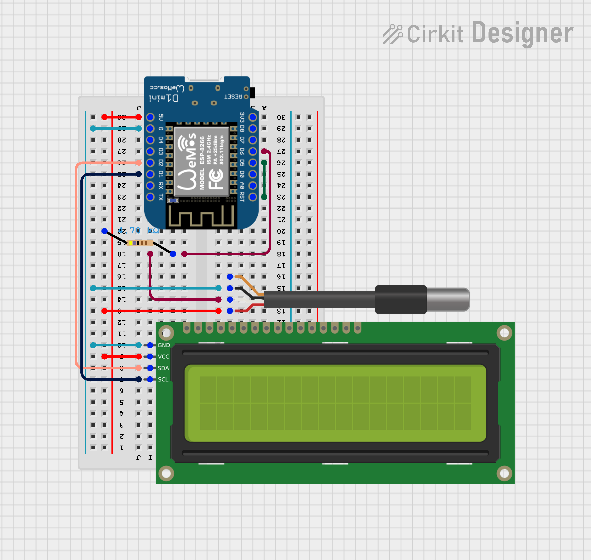

# Polaris

Polaris is an IoT device powered by an ESP8266 that monitors temperature. A web application
is provided for management of multiple devices and data analisys.

# Development
This is a work in progress, the wemos code is under development following this circuit:

A ToDo task can be found in wemos_code directory.

# License
This project is under the Creative Commons Attribution-NonCommercial-ShareAlike 4.0 International (CC BY-NC-SA 4.0) license.
More info here: https://creativecommons.org/licenses/by-nc-sa/4.0/
